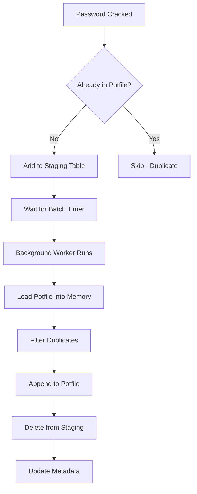

# Potfile Management

The potfile (short for "pot file" from hashcat terminology) is an automated feature in KrakenHashes that accumulates successfully cracked passwords into a specialized wordlist. This dynamic wordlist significantly improves cracking efficiency by trying previously successful passwords against new hashes.

## Table of Contents

1. [Overview](#overview)
2. [How It Works](#how-it-works)
3. [Configuration Settings](#configuration-settings)
4. [File Structure and Location](#file-structure-and-location)
5. [Staging and Processing Mechanism](#staging-and-processing-mechanism)
6. [Integration with Jobs](#integration-with-jobs)
7. [Monitoring and Troubleshooting](#monitoring-and-troubleshooting)
8. [Best Practices](#best-practices)

## Overview

### Purpose

The potfile serves as an organizational memory of all passwords that have been successfully cracked. By maintaining this list, KrakenHashes can:

- **Accelerate future cracking**: Common passwords that worked before are likely to work again
- **Identify password reuse**: Quickly detect when the same password is used across different accounts
- **Build organizational intelligence**: Accumulate knowledge of password patterns specific to your targets
- **Optimize resource usage**: Reduce GPU time by trying known passwords first

### Key Benefits

1. **Automatic Management**: No manual intervention required - the system handles everything
2. **Real-time Updates**: Passwords are staged immediately upon cracking
3. **Deduplication**: Prevents duplicate entries automatically
4. **Distributed Access**: All agents receive the updated potfile for use in jobs
5. **Performance Optimization**: Batch processing minimizes system overhead

## How It Works

The potfile system operates through a multi-stage automated process:

### 1. Password Crack Detection
When an agent successfully cracks a password hash:
- The cracked password is sent to the backend server
- The backend records the crack in the database
- The password is checked against existing potfile entries

### 2. Staging Process
If the password is new (not already in the potfile):
- It's added to the `potfile_staging` table
- The entry includes the plaintext password and original hash value
- Multiple passwords can accumulate in staging

### 3. Batch Processing
A background worker runs periodically (default: every 60 seconds):
- Retrieves all unprocessed entries from staging
- Loads the current potfile into memory for deduplication
- Filters out any passwords already in the potfile
- Appends new unique passwords to the potfile
- Deletes processed entries from the staging table

### 4. Distribution
Once updated:
- The potfile's MD5 hash is recalculated
- Agents are notified of the update
- The potfile becomes available for use in cracking jobs

## Configuration Settings

The potfile feature is controlled through system settings in the database:

| Setting | Default | Description |
|---------|---------|-------------|
| `potfile_enabled` | `true` | Master switch to enable/disable the potfile feature |
| `potfile_batch_interval` | `60` | Seconds between batch processing runs |
| `potfile_max_batch_size` | `1000` | Maximum number of entries to process in a single batch |
| `potfile_wordlist_id` | (auto) | Database ID of the potfile wordlist entry |
| `potfile_preset_job_id` | (auto) | Database ID of the associated preset job |

### Modifying Settings

Settings can be modified through direct database updates:

```sql
-- Change batch interval to 30 seconds
UPDATE system_settings 
SET value = '30' 
WHERE key = 'potfile_batch_interval';

-- Increase max batch size
UPDATE system_settings 
SET value = '5000' 
WHERE key = 'potfile_max_batch_size';

-- Disable potfile feature
UPDATE system_settings 
SET value = 'false' 
WHERE key = 'potfile_enabled';
```

> **Note**: Changes to settings require a server restart to take effect.

## File Structure and Location

### File Location
```
<data_dir>/wordlists/custom/potfile.txt
```

Typically:
```
/data/krakenhashes/wordlists/custom/potfile.txt
```

### File Format
- **Plain text file**: One password per line
- **Initial content**: Starts with a single blank line (representing an empty password)
- **Encoding**: UTF-8
- **Line endings**: Unix-style (LF)

### Example Content
```
(blank line)
password123
Admin@1234
Welcome2024!
CompanyName123
```

### Automatic Creation
- Created automatically on first server startup
- Initialized with a single blank line
- Registered as a wordlist in the database
- Associated with a preset job for easy use

## Staging and Processing Mechanism

### Staging Table Structure

The `potfile_staging` table temporarily holds passwords before batch processing:

| Column | Type | Description |
|--------|------|-------------|
| `id` | integer | Unique identifier |
| `password` | text | The plaintext password |
| `hash_value` | text | Original hash that was cracked |
| `created_at` | timestamp | When the entry was staged |
| `processed` | boolean | No longer used (entries are deleted after processing) |

### Processing Workflow



### Deduplication Logic

- **Comparison basis**: Plaintext passwords only (not hashes)
- **Case sensitivity**: Passwords are case-sensitive
- **Empty passwords**: Blank lines are valid passwords
- **Within-batch**: Duplicates within the same batch are also filtered

## Integration with Jobs

### Automatic Preset Job

The system automatically creates a preset job for the potfile:
- **Name**: "Potfile Dictionary Attack"
- **Type**: Dictionary attack using the potfile as the wordlist
- **Priority**: Can be configured for high-priority execution
- **Agents**: Available to all agents

### Using the Potfile in Jobs

1. **Automatic inclusion**: The potfile preset job can be included in job workflows
2. **Manual selection**: Administrators can select the potfile wordlist when creating custom jobs
3. **First-pass attack**: Often used as the first attack in a workflow due to high success rate

### Keyspace Calculation

- The potfile's word count is automatically updated after each batch
- Keyspace for jobs using the potfile adjusts dynamically
- Agents receive updated keyspace information

## Monitoring and Troubleshooting

### Check Potfile Status

```bash
# View potfile contents
cat /data/krakenhashes/wordlists/custom/potfile.txt

# Count passwords in potfile
wc -l /data/krakenhashes/wordlists/custom/potfile.txt

# Check file size
ls -lh /data/krakenhashes/wordlists/custom/potfile.txt
```

### Monitor Staging Table

```sql
-- Count staged entries
SELECT COUNT(*) FROM potfile_staging;

-- View recent staged passwords
SELECT password, created_at 
FROM potfile_staging 
ORDER BY created_at DESC 
LIMIT 10;

-- Check for processing issues
SELECT COUNT(*) as stuck_entries 
FROM potfile_staging 
WHERE created_at < NOW() - INTERVAL '1 hour';
```

### Check Processing Logs

```bash
# View potfile-related logs
docker logs krakenhashes 2>&1 | grep -i potfile

# Check for staging activity
docker logs krakenhashes 2>&1 | grep "staged password"

# Monitor batch processing
docker logs krakenhashes 2>&1 | grep "Processing.*staged pot-file entries"
```

### Common Issues and Solutions

| Issue | Cause | Solution |
|-------|-------|----------|
| Passwords not being added | Potfile disabled | Check `potfile_enabled` setting |
| Staging table growing | Processing stopped | Restart server, check logs for errors |
| Duplicate passwords appearing | File manually edited | Let system manage the file |
| Potfile not updating | Batch interval too long | Reduce `potfile_batch_interval` |
| High memory usage | Large potfile | Consider archiving old entries |

## Best Practices

### Operational Guidelines

1. **Let the system manage the potfile**
   - Don't manually edit while the server is running
   - Use the staging mechanism for all additions
   - Trust the deduplication logic

2. **Monitor staging table size**
   ```sql
   -- Set up an alert if staging exceeds threshold
   SELECT COUNT(*) FROM potfile_staging;
   ```

3. **Balance batch processing**
   - Shorter intervals: More responsive but higher overhead
   - Longer intervals: More efficient but delayed updates
   - Recommended: 30-60 seconds for most deployments

4. **Regular maintenance**
   - Monitor potfile size growth
   - Consider rotating very large potfiles (>1GB)
   - Archive historical passwords if needed

### Performance Considerations

- **Memory usage**: The entire potfile is loaded into memory during processing
- **Disk I/O**: Frequent updates can cause disk activity
- **Network transfer**: Large potfiles take time to sync to agents
- **Database load**: Staging table operations add database activity

### Security Notes

> **Important**: The potfile contains actual passwords in plaintext

- Protect the potfile with appropriate file permissions
- Ensure backups are encrypted
- Limit access to the system data directory
- Consider compliance requirements for password storage
- Implement audit logging for potfile access

### Backup and Recovery

1. **Include in backups**: The potfile should be part of regular system backups
2. **Database consistency**: Back up both the potfile and database together
3. **Recovery process**: 
   - Restore the potfile to its original location
   - Verify the `potfile_wordlist_id` matches the database
   - Clear any orphaned staging entries
   - Restart the server

### Integration Tips

- **Workflow optimization**: Place potfile attack early in job workflows
- **Custom rules**: Combine potfile with rule-based attacks for variations
- **Hybrid attacks**: Use potfile + mask attacks for pattern matching
- **Regular updates**: Ensure agents sync regularly for latest passwords

## Advanced Usage

### Manual Staging

If needed, passwords can be manually staged:

```sql
-- Manually stage a password
INSERT INTO potfile_staging (password, hash_value, created_at, processed)
VALUES ('NewPassword123', 'manual_entry', NOW(), false);
```

### Bulk Import

For importing existing password lists:

```sql
-- Import from external source (use with caution)
INSERT INTO potfile_staging (password, hash_value, created_at, processed)
SELECT DISTINCT password, 'bulk_import', NOW(), false
FROM external_password_source
WHERE password NOT IN (
    SELECT line FROM potfile_lines
);
```

### Potfile Analysis

```sql
-- Most recent additions
SELECT password, created_at 
FROM potfile_staging 
ORDER BY created_at DESC 
LIMIT 20;

-- Processing rate
SELECT 
    DATE_TRUNC('hour', created_at) as hour,
    COUNT(*) as passwords_staged
FROM potfile_staging
WHERE created_at > NOW() - INTERVAL '24 hours'
GROUP BY hour
ORDER BY hour;
```

## Summary

The potfile is a powerful feature that automatically builds organizational knowledge of successful passwords. By accumulating cracked passwords and making them available for future jobs, it significantly improves cracking efficiency over time. The automated staging and batch processing system ensures reliable operation with minimal administrative overhead.

Key points to remember:
- Fully automated operation with configurable parameters
- Intelligent deduplication prevents redundant entries  
- Seamless integration with the job system
- Minimal performance impact through batch processing
- Critical asset for improving crack rates over time

For additional assistance or advanced configuration needs, consult the system logs or contact support.