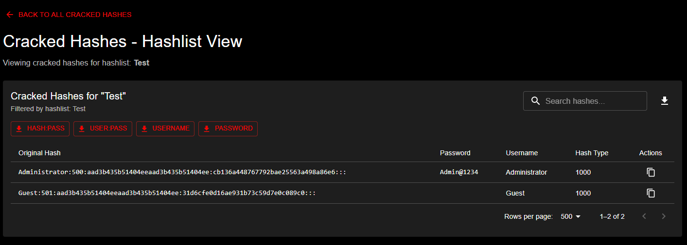
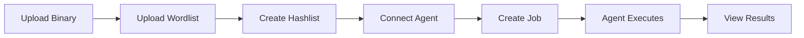

# Your First Password Crack

This guide walks you through performing your first password crack with KrakenHashes. By the end of this tutorial, you'll understand the complete workflow from setup to viewing results.

!!! note "Prerequisites"
    - KrakenHashes is installed and running
    - You're logged in as an admin user
    - You have access to a hashcat binary file
    - At least one agent machine is available (can be the same as the server)

## Step 1: Upload Hashcat Binary

First, we need to upload the hashcat binary that agents will use to perform the actual cracking.

### Navigate to Binary Management

1. From the main menu, click **Admin** → **Binary Management**
2. Click the **Add Binary** button in the top right

{ .screenshot }

### Upload the Binary

1. In the upload dialog:
   - Click **Choose File** or drag and drop your hashcat binary
   - Supported formats: `.7z`, `.zip`, `.tar.gz`
   - The binary should be compressed and include all necessary files

2. Click **Upload** and wait for the process to complete

!!! tip "Getting Hashcat"
    If you don't have hashcat, download it from [hashcat.net/hashcat/](https://hashcat.net/hashcat/)
    
    For this tutorial, download the appropriate binary for your system:
    - Linux: `hashcat-6.2.6.7z`
    - Windows: `hashcat-6.2.6.exe` (compress to .zip first)

3. After upload, the system will automatically verify the binary
   - Status should show as **verified** ✓
   - Note the Binary ID for later reference

## Step 2: Upload a Simple Wordlist

Next, let's create a basic wordlist for our first crack attempt.

### Navigate to Wordlist Management

1. From the main menu, click **Resources** → **Wordlists**
2. Click the **Add Wordlist** button

{ .screenshot }

### Create a Test Wordlist

For this tutorial, let's create a simple wordlist file:

1. Create a text file named `common-passwords.txt` with these contents:
   ```
   password
   123456
   password123
   admin
   letmein
   welcome
   monkey
   dragon
   ```

2. In the upload dialog:
   - **Name**: "Common Passwords Tutorial"
   - **Description**: "Basic wordlist for first crack tutorial"
   - **Type**: General
   - **File**: Select your `common-passwords.txt`

3. Click **Upload**

!!! info "Wordlist Types"
    - **General**: Standard password lists
    - **Usernames**: Lists of common usernames
    - **Custom**: Specialized wordlists for specific targets

## Step 3: Create a Test Hashlist

Now let's create some password hashes to crack. We'll use known passwords so you can verify the results.

### Prepare Test Hashes

1. Create a file named `test-hashes.txt` with these MD5 hashes:
   ```
   5f4dcc3b5aa765d61d8327deb882cf99
   e10adc3949ba59abbe56e057f20f883e
   482c811da5d5b4bc6d497ffa98491e38
   ```

!!! note "What are these hashes?"
    These are MD5 hashes of:
    - `password` → 5f4dcc3b5aa765d61d8327deb882cf99
    - `123456` → e10adc3949ba59abbe56e057f20f883e  
    - `password123` → 482c811da5d5b4bc6d497ffa98491e38

### Upload the Hashlist

1. Navigate to **Hashlists** from the main menu


*Hashlist Management page with UPLOAD HASHLIST button highlighted, showing the interface where users can view existing hashlists and initiate new uploads*

2. Click **Upload Hashlist**

{ .screenshot }

3. Fill in the details:
   - **Name**: "Tutorial Test Hashes"
   - **Description**: "MD5 hashes for first crack tutorial"
   - **Hash Type**: MD5 (mode 0)
   - **Client**: (Optional - leave blank for tutorial)
   - **File**: Select your `test-hashes.txt`

4. Click **Upload**

The system will process your hashlist and show:
- Total hashes: 3
- Unique hashes: 3
- Status: Active

## Step 4: Connect an Agent

Agents are the worker machines that perform the actual password cracking. Let's connect one.

### Generate a Claim Code

1. Navigate to **Admin** → **Agent Management**
2. Click **Generate Claim Code**

{ .screenshot }

3. A claim code will be generated (e.g., `ABCD-EFGH-IJKL`)
4. Copy this code - you'll need it for the agent

### Install and Configure the Agent

On your agent machine (can be the same as the server):

1. Download the KrakenHashes agent for your platform
2. Extract it to a directory
3. Run the registration command:
   ```bash
   ./krakenhashes-agent register --server https://your-server:8443 --claim-code ABCD-EFGH-IJKL
   ```

4. The agent will:
   - Register with the server
   - Receive an API key
   - Start heartbeat communication
   - Sync required files (binaries, wordlists)

!!! success "Agent Connected!"
    Once registered, you'll see the agent appear in the Agent Management page with:
    - Status: **Online** 🟢
    - Hardware info (GPU details if available)
    - Last heartbeat timestamp

## Step 5: Create and Run a Job

Now for the exciting part - let's crack those passwords!

### Create a New Job

1. Go back to **Hashlists**
2. Find your "Tutorial Test Hashes" and click on it
3. Click **Create Job** button

{ .screenshot }

### Configure the Job

You have three options for creating jobs:

=== "Quick Job (Recommended for Tutorial)"

    1. Select the **Preset Jobs** tab
    2. Choose **"Quick Dictionary Attack"**
    3. This preset includes:
       - Dictionary attack with your wordlists
       - Basic rules for variations
       - Optimized for speed

=== "Custom Job"

    1. Select the **Custom** tab
    2. Configure:
       - **Name**: "Tutorial First Crack"
       - **Attack Mode**: Dictionary (0)
       - **Wordlists**: Select "Common Passwords Tutorial"
       - **Rules**: (Optional - leave empty for now)

=== "Workflow"

    1. Select the **Workflows** tab
    2. Choose a predefined workflow that runs multiple attack strategies

### Start the Job

1. Review your settings
2. Click **Create Job**

The job will be:
- Added to the queue
- Assigned to an available agent
- Started automatically

## Step 6: Monitor Progress

### View Job Status

1. Navigate to **Jobs** from the main menu
2. Find your job in the list

{ .screenshot }

You'll see:
- **Status**: Running 🔄
- **Progress**: Percentage complete
- **Speed**: Hashes per second
- **Time**: Elapsed and estimated remaining

### Real-time Updates

The dashboard updates in real-time showing:
- Candidates tested
- Passwords cracked
- Current speed
- Agent assignment

!!! tip "Understanding Speed"
    Speed is measured in H/s (hashes per second). Higher is better!
    - CPU only: 1,000 - 100,000 H/s
    - Single GPU: 1,000,000+ H/s
    - Multiple GPUs: Much higher!

## Step 7: View Results

Once the job completes (should be quick for this tutorial):

### Check the Results

1. Go back to your hashlist
2. You'll see the status has updated:
   - **Cracked**: 3/3 (100%)
   - Status indicators next to each hash

### View Cracked Passwords

1. Click on a cracked hash to see details
2. The plaintext password will be displayed
3. You should see:
   - `5f4dcc3b5aa765d61d8327deb882cf99` → `password`
   - `e10adc3949ba59abbe56e057f20f883e` → `123456`
   - `482c811da5d5b4bc6d497ffa98491e38` → `password123`


*Hashlist view showing successfully cracked passwords with their plaintext values revealed*

### Export Results

1. Click **Export** button
2. Choose format:
   - **CSV**: For spreadsheets
   - **JSON**: For programming
   - **Hashcat Potfile**: hash:plain format

3. Download includes:
   - Original hashes
   - Cracked plaintexts
   - Crack timestamps
   - Metadata

## Understanding What Happened

Let's review the complete workflow:



### Key Concepts

1. **Hashcat Binary**: The actual cracking engine
   - Agents download and use this
   - Supports many hash types and attack modes

2. **Wordlists**: Lists of potential passwords
   - Can be general or targeted
   - Quality matters more than quantity

3. **Hashlists**: Your target hashes to crack
   - Organized by hash type
   - Can contain thousands or millions

4. **Agents**: Distributed workers
   - Can be anywhere with internet
   - Automatically sync files
   - Report progress in real-time

5. **Jobs**: Work assignments
   - Define what to try (wordlists, rules, masks)
   - Can be simple or complex workflows
   - Automatically distributed to agents


*Main dashboard view showing hashlist management with crack statistics and job execution interface - what you'll see after completing your first successful password crack*

## Next Steps

Now that you've completed your first crack:

### 1. Try More Complex Attacks

- **Add Rules**: Transform wordlists (password → Password123!)
- **Use Masks**: Pattern-based attacks (?u?l?l?l?d?d?d?d)
- **Combination Attacks**: Combine multiple wordlists

### 2. Scale Up

- **Add More Agents**: Distribute work across multiple machines
- **Use GPUs**: Dramatically increase cracking speed
- **Upload Larger Wordlists**: Try rockyou.txt or custom lists

### 3. Create Workflows

Build multi-stage attacks:
1. Quick dictionary attack
2. Dictionary with rules
3. Targeted masks
4. Brute force (last resort)

### 4. Explore Features

- **Client Management**: Organize hashlists by client/project
- **Scheduling**: Control when agents run jobs
- **Retention Policies**: Automatic cleanup of old data
- **Team Collaboration**: Share access with team members

## Troubleshooting

### Common Issues

??? question "Agent won't connect"
    - Check firewall rules (port 8443)
    - Verify server URL is correct
    - Ensure claim code hasn't expired
    - Check agent logs for errors

??? question "Job stuck in queue"
    - Verify agent is online
    - Check agent has required hardware
    - Ensure binary is verified
    - Look for error messages

??? question "No passwords cracked"
    - Try a different wordlist
    - Add rules for variations
    - Check hash type is correct
    - Verify hash format

??? question "Slow performance"
    - Use GPU-enabled agents
    - Optimize wordlists (remove duplicates)
    - Check network connectivity
    - Monitor system resources

## Summary

Congratulations! You've successfully:

- ✅ Uploaded a hashcat binary
- ✅ Created a wordlist
- ✅ Uploaded target hashes
- ✅ Connected an agent
- ✅ Ran a cracking job
- ✅ Retrieved cracked passwords

You now understand the fundamental workflow of KrakenHashes. From here, you can scale up to crack real-world password hashes with more sophisticated attacks and distributed agents.

!!! success "Ready for Real Work!"
    You're now equipped to:
    
    - Handle client hashlist submissions
    - Build effective attack strategies  
    - Manage distributed cracking operations
    - Deliver results efficiently

## Additional Resources

- [Understanding Hash Types](../reference/hash-types.md)
- [Building Better Wordlists](../user-guide/wordlists-rules.md)
- [Advanced Attack Strategies](../admin-guide/advanced/presets.md)
- [Agent Deployment Guide](../agents/README.md)