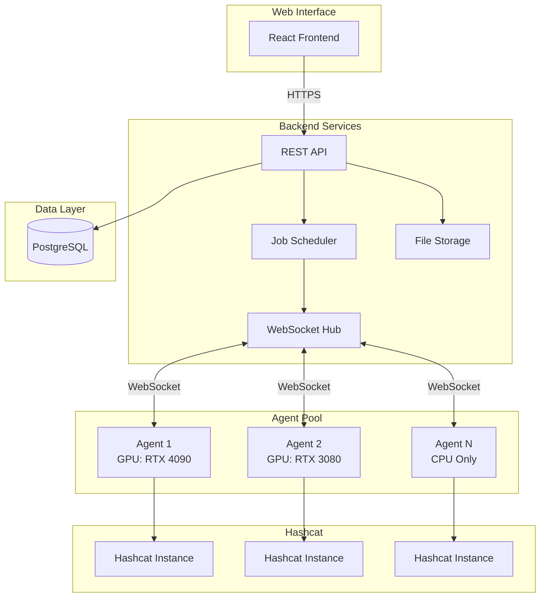
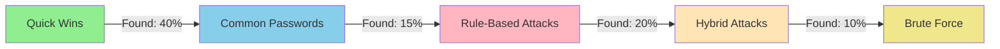

# Overview

## What is KrakenHashes?

KrakenHashes is a distributed password cracking management system that transforms the power of Hashcat into an enterprise-ready platform. While Hashcat excels as a command-line tool for password recovery, KrakenHashes adds the orchestration, management, and collaboration features needed for professional security teams.

Think of KrakenHashes as the control center for your password auditing operations – coordinating multiple machines, managing vast collections of hashes, and providing actionable insights through an intuitive web interface.

## Why KrakenHashes?

### The Challenge with Direct Hashcat Usage

Running Hashcat directly presents several challenges for security teams:

- **Single Machine Limitation**: Hashcat runs on one machine at a time
- **Manual Coordination**: No built-in way to distribute work across multiple systems
- **Limited Visibility**: Command-line output makes it hard to track multiple jobs
- **No Collaboration**: Difficult for teams to share resources and results
- **Manual Management**: Wordlists, rules, and results require manual organization

### The KrakenHashes Solution

KrakenHashes addresses these limitations by providing:

- **Distributed Processing**: Coordinate multiple agents across your infrastructure
- **Centralized Management**: Single interface for all your cracking operations
- **Team Collaboration**: Share resources, results, and strategies
- **Automated Workflows**: Pre-configured attack patterns and job templates
- **Enterprise Features**: Authentication, authorization, and audit trails

## Key Features and Capabilities

### 🚀 Distributed Architecture

-   **Multi-Agent Support**
    
    Deploy agents on multiple machines to leverage all available hardware

-   **Automatic Load Balancing**
    
    Jobs are intelligently distributed based on agent capabilities

-   **Dynamic Scaling**
    
    Add or remove agents without interrupting active jobs

-   **Resource Scheduling**
    
    Configure when agents are available for processing

### 📊 Job Management

KrakenHashes transforms password cracking from ad-hoc commands into managed operations:

- **Job Templates**: Pre-configured attack strategies for common scenarios
- **Workflows**: Chain multiple attack types for comprehensive audits
- **Priority System**: Ensure critical jobs get resources first (0-1000 scale)
- **Progress Tracking**: Real-time visibility into job status and ETA
- **Automatic Chunking**: Large jobs are split for optimal distribution

### 🗂️ Resource Organization

Centralized management of all cracking resources:

- **Wordlist Library**: Upload once, use across all agents
- **Rule Management**: Organize and version your rule files
- **Binary Versioning**: Ensure all agents run compatible Hashcat versions
- **Hash Organization**: Group hashes by client, project, or engagement
- **Result Storage**: Automatic capture and organization of cracked passwords

### 🔒 Security & Compliance

Built with enterprise security requirements in mind:

- **Multi-Factor Authentication**: TOTP, email, and backup codes
- **Role-Based Access**: Admin and user roles with granular permissions
- **TLS/SSL Support**: Multiple certificate options including self-signed
- **Audit Logging**: Track all actions for compliance requirements
- **Data Retention**: Configurable policies for automatic cleanup
- **Client Isolation**: Keep customer data properly segregated

## System Architecture

### Component Breakdown

!!! info "Backend Service (Go)"
    The brain of KrakenHashes, handling:
    
    - RESTful API for all client operations
    - WebSocket management for real-time agent communication
    - Job scheduling with intelligent distribution algorithms
    - File synchronization to ensure agents have required resources
    - Database operations for persistent storage

!!! info "Agent System (Go)"
    Distributed workers that:
    
    - Execute Hashcat with optimized parameters
    - Monitor hardware health (temperature, usage)
    - Report progress in real-time
    - Automatically sync required files from backend
    - Support scheduling for resource availability

!!! info "Web Interface (React)"
    Modern, responsive UI featuring:
    
    - Real-time job monitoring dashboards
    - Drag-and-drop file uploads
    - Interactive result analysis
    - Administrative controls
    - Mobile-friendly responsive design

!!! info "PostgreSQL Database"
    Reliable data storage for:
    
    - User accounts and permissions
    - Job definitions and results
    - Hash lists and cracked passwords
    - Agent registrations and metrics
    - Audit logs and system configuration

## Typical Use Cases

### 🔍 Penetration Testing

During security assessments, teams often need to:

- Test password strength across multiple client environments
- Maintain separation between different client data
- Generate compliance reports showing password vulnerabilities
- Coordinate efforts across team members

**KrakenHashes Solution**: Create separate clients for each engagement, assign team members appropriately, and use preset workflows to ensure consistent testing methodology.

### 🚨 Incident Response

When responding to security incidents:

- Time is critical – need results fast
- May have various hash formats from different systems
- Need to document the recovery process
- Multiple analysts working simultaneously

**KrakenHashes Solution**: Use high-priority jobs to get critical results first, leverage distributed agents for speed, and maintain audit trails for evidence handling.

### 🔬 Security Research

Researchers analyzing password security need:

- Consistent benchmarking across hash types
- Ability to test new attack methodologies
- Performance metrics and statistics
- Reproducible results

**KrakenHashes Solution**: Built-in benchmarking system, custom workflow creation, detailed metrics collection, and comprehensive result export options.

### 🏢 Corporate Security Audits

Internal security teams conducting password audits require:

- Regular testing of AD password dumps
- Tracking improvement over time
- Executive-friendly reporting
- Automated testing schedules

**KrakenHashes Solution**: Scheduled jobs, historical tracking, client-based organization for different departments, and retention policies for compliance.

## Workflows: Attack Strategy Made Simple

One of KrakenHashes' most powerful features is the workflow system. Instead of manually running different Hashcat commands, you can define comprehensive attack strategies:

### Example: Standard Password Audit Workflow

1. **Quick Wins** - Try the most common passwords first
2. **Common Passwords** - Test against known breach compilations
3. **Rule-Based** - Apply transformations to wordlists
4. **Hybrid Attacks** - Combine wordlists with masks
5. **Brute Force** - Last resort for remaining hashes

## Security Considerations

### 🛡️ Data Protection

- All agent communication is encrypted
- Passwords are never logged in plaintext
- Database connections use SSL/TLS
- File transfers are authenticated and encrypted

### 🔐 Access Control

- JWT-based authentication with refresh tokens
- Multi-factor authentication options
- Role-based permissions (Admin/User)
- Secure session management with token validation

### 📝 Compliance

- Comprehensive audit logging
- Data retention policies
- Client data isolation
- Export capabilities for reporting

### ⚠️ Operational Security

!!! warning "Important Security Notes"
    - Deploy behind a firewall - never expose directly to internet
    - Use strong passwords for all accounts
    - Enable MFA for all users, especially administrators  
    - Regularly review audit logs
    - Keep agents and Hashcat binaries updated
    - Use TLS certificates (self-signed minimum)

## Getting Started

Ready to deploy KrakenHashes? Here's your path forward:

1. **[Quick Start Guide](quick-start.md)** - Get running in 5 minutes with Docker
2. **[Installation Guide](installation.md)** - Detailed setup for production
3. **[First Crack Tutorial](first-crack.md)** - Step-by-step first password recovery
4. **[User Guide](../user-guide/index.md)** - Learn all features and capabilities

## Comparison: KrakenHashes vs Direct Hashcat

| Feature | Hashcat | KrakenHashes |
|---------|---------|--------------|
| **Setup** | Simple binary | Docker deployment |
| **Interface** | Command line | Web UI + API |
| **Multi-machine** | Manual coordination | Automatic distribution |
| **Job Management** | Scripts/manual | Database-backed queue |
| **Progress Tracking** | Terminal output | Real-time dashboard |
| **Result Storage** | Text files | Structured database |
| **Team Collaboration** | File sharing | Built-in sharing |
| **Resource Management** | Manual copying | Automatic sync |
| **User Management** | OS-level | Application-level |
| **Audit Trail** | None | Comprehensive |
| **Scheduling** | Cron jobs | Built-in scheduler |
| **MFA Support** | N/A | TOTP, Email, Backup codes |

## Next Steps

Now that you understand what KrakenHashes offers, choose your next step:

-   :material-rocket-launch: **[Quick Start](quick-start.md)**
    
    Get up and running in minutes with our Docker setup

-   :material-book-open: **[User Guide](../user-guide/index.md)**
    
    Deep dive into features and capabilities

-   :material-shield: **[Security Setup](../admin-guide/system-setup/ssl-tls.md)**
    
    Configure TLS and authentication for production

-   :material-server: **[Agent Deployment](../agents/README.md)**
    
    Learn how to deploy and manage agents

---

!!! info "Version Note"
    This documentation reflects KrakenHashes v0.1.0-alpha. As the project is under active development, features may change. Always refer to the [GitHub repository](https://github.com/ZerkerEOD/krakenhashes) for the latest updates.