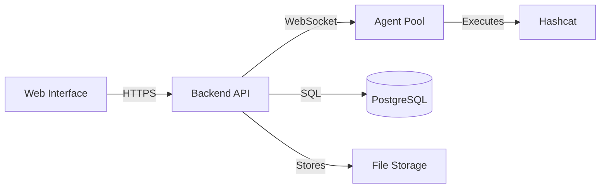

# Welcome to KrakenHashes

<div align="center">
<h2>Distributed Password Cracking System for Security Professionals</h2>
<p>
<a href="https://github.com/ZerkerEOD/krakenhashes"></a>
<a href="https://github.com/ZerkerEOD/krakenhashes/blob/main/LICENSE"></a>
<a href="https://discord.gg/taafA9cSFV"></a>
</p>
</div>

## What is KrakenHashes?

KrakenHashes is a powerful distributed password cracking platform that coordinates GPU and CPU resources across multiple agents to perform high-speed hash cracking. Built for security professionals, penetration testers, and red teams, it provides a secure web interface for managing complex password auditing operations.

<div class="grid cards" markdown>

-   :material-speedometer:{ .lg .middle } **High Performance**

    ---

    Leverage distributed GPU/CPU resources across multiple agents for maximum cracking speed

-   :material-shield-check:{ .lg .middle } **Enterprise Security**

    ---

    JWT authentication, MFA support, role-based access control, and encrypted communications

-   :material-web:{ .lg .middle } **Modern Web Interface**

    ---

    Intuitive React-based UI for job management, real-time monitoring, and result analysis

-   :material-server-network:{ .lg .middle } **Scalable Architecture**

    ---

    Add agents dynamically, schedule resources, and manage workloads efficiently

</div>

## Quick Start

Get KrakenHashes running in under 5 minutes with Docker!

```bash
# Download and run
mkdir krakenhashes && cd krakenhashes
wget https://raw.githubusercontent.com/ZerkerEOD/krakenhashes/main/docker-compose.yml
wget https://raw.githubusercontent.com/ZerkerEOD/krakenhashes/main/.env.example
cp .env.example .env
# Edit .env to set passwords
docker-compose up -d
```

[Get Started :material-arrow-right:](getting-started/quick-start.md){ .md-button .md-button--primary }
[Installation Guide](getting-started/installation.md){ .md-button }

## Key Features

### :material-puzzle: **Intelligent Job Management**
- Preset job templates and workflows for common attack patterns
- Priority-based scheduling with adaptive load balancing
- Automatic job chunking for optimal distribution
- Real-time progress tracking and ETA calculations

### :material-file-document-multiple: **Comprehensive Hash Support**
- Support for 300+ hash types via Hashcat
- Automatic hash type detection
- Bulk hash import and management
- Client-based organization for engagements

### :material-folder-sync: **Resource Management**
- Centralized wordlist and rule file management
- Automatic file synchronization to agents
- Binary version management for Hashcat
- Efficient storage with deduplication

### :material-monitor-dashboard: **Real-Time Monitoring**
- Live job progress visualization
- Agent health and performance metrics
- GPU/CPU temperature and usage tracking
- WebSocket-based real-time updates

### :material-account-group: **Multi-User Collaboration**
- Role-based access control (Admin/User)
- Client and engagement management
- Audit logging for compliance
- Data retention policies

### :material-lock: **Enterprise Security**
- Multi-factor authentication (TOTP, Email, Backup codes)
- TLS/SSL support with multiple certificate options
- API key authentication for agents
- Session management with IP validation

## Use Cases

<div class="grid cards" markdown>

-   **Penetration Testing**

    Coordinate password audits across multiple client engagements with proper data isolation

-   **Security Assessments**

    Validate password policies by testing organizational hash dumps against common patterns

-   **Incident Response**

    Quickly crack passwords during forensic investigations and evidence recovery

-   **Security Research**

    Analyze hash algorithm vulnerabilities and benchmark cracking performance

</div>

## System Components



- **Backend Service** - Go-based API server with job scheduling and resource management
- **Web Interface** - React frontend with Material-UI for intuitive user experience  
- **Agent System** - Distributed agents that execute Hashcat with hardware optimization
- **PostgreSQL Database** - Reliable storage for jobs, results, and system configuration

## Documentation Overview

<div class="grid cards" markdown>

-   :material-rocket-launch: **[Getting Started](getting-started/overview.md)**

    New to KrakenHashes? Start here for installation and your first crack

-   :material-account: **[User Guide](user-guide/index.md)**

    Learn how to create jobs, manage hashlists, and analyze results

-   :material-cog: **[Admin Guide](admin-guide/index.md)**

    System configuration, user management, and operational procedures

-   :material-server: **[Deployment](deployment/index.md)**

    Production deployment, Docker setup, and update procedures

</div>

## Project Status

!!! warning "Alpha Software"
    KrakenHashes is currently in **alpha development** (v0.1.0). While core functionality is implemented, expect:
    
    - Breaking changes between versions
    - Incomplete features and documentation
    - No migration path for data until v1.0
    - Active development with frequent updates

See our [GitHub repository](https://github.com/ZerkerEOD/krakenhashes) for the latest development status and roadmap.

## Getting Help

- :material-book-open: **Documentation** - You're here! Browse the guides
- :material-github: **GitHub Issues** - Report bugs and request features
- :material-chat: **Discord Community** - Join our [Discord server](https://discord.gg/taafA9cSFV)
- :material-email: **Email** - Contact for security issues

## License

KrakenHashes is open source software licensed under the [GNU Affero General Public License v3.0](https://github.com/ZerkerEOD/krakenhashes/blob/main/LICENSE).