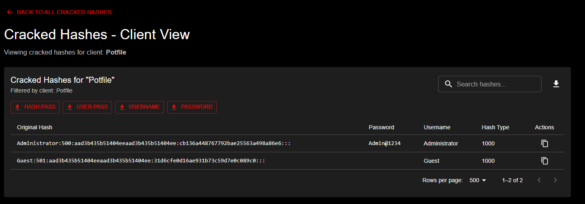

# Analyzing Password Cracking Results

This guide covers how to view, analyze, and export password cracking results in KrakenHashes. The system provides comprehensive tools for examining cracked passwords at different levels and exporting data for reporting purposes.

## Table of Contents

- [Understanding POT Files and Results](#understanding-pot-files-and-results)
- [Viewing Results at Different Levels](#viewing-results-at-different-levels)
- [Filtering and Searching Results](#filtering-and-searching-results)
- [Export Options and Formats](#export-options-and-formats)
- [Analyzing Patterns and Statistics](#analyzing-patterns-and-statistics)
- [Using Results for Reporting](#using-results-for-reporting)
- [Best Practices for Handling Sensitive Data](#best-practices-for-handling-sensitive-data)

## Understanding POT Files and Results

### What is a POT File?

A POT file (short for "potfile") is a standard format used by Hashcat and other password cracking tools to store successfully cracked hashes. KrakenHashes maintains a centralized POT database that tracks:

- **Original Hash**: The hash value as it appeared in the source data
- **Password**: The plaintext password that was recovered
- **Username**: Associated username (if available from the hash format)
- **Hash Type**: The algorithm used (MD5, SHA1, NTLM, etc.)
- **Metadata**: When the hash was cracked, which job cracked it, etc.

### How Results are Stored

KrakenHashes stores cracked passwords in a PostgreSQL database rather than traditional POT files. This provides:

- **Deduplication**: Each unique hash is stored only once
- **Performance**: Fast queries across millions of cracked hashes
- **Security**: Database-level access controls and encryption
- **Rich Metadata**: Track which client, hashlist, and job produced each crack

## Viewing Results at Different Levels

KrakenHashes provides three levels of result viewing, each offering different perspectives on your cracked passwords:

### 1. Master POT View

The Master POT view shows all cracked hashes across your entire KrakenHashes instance.

**Access**: Navigate to **POT** in the main menu


*Master POT view showing all cracked hashes with filter options for different export formats*

**Use Cases**:
- Overall password analysis across all engagements
- Building universal password dictionaries
- Identifying common passwords across different clients

### 2. Client-Level Results

View all cracked passwords for a specific client/engagement.

**Access**: 
1. Go to **Clients**
2. Select a client
3. Click **View POT** or the POT icon


*Filter results to show only cracked passwords for a specific client or engagement*

**Use Cases**:
- Client-specific reporting
- Understanding password patterns within an organization
- Compliance reporting for specific engagements

### 3. Hashlist-Level Results

View cracked passwords for a specific hashlist.

**Access**:
1. Go to **Hashlists**
2. Select a hashlist
3. Click **View POT** in the actions menu


*View cracked passwords from a particular hashlist with detailed crack information*

**Use Cases**:
- Analyzing results from specific sources (AD dump, database, etc.)
- Comparing crack rates between different hash types
- Focused analysis on specific user groups

### 4. Job-Level Results (Coming Soon)

Future releases will add job-specific result viewing to track which attack strategies were most effective.

## Filtering and Searching Results

### Search Functionality

Each POT view includes a search bar that filters results in real-time:

- **Hash Search**: Find specific hash values
- **Password Search**: Look for passwords containing specific strings
- **Username Search**: Filter by username patterns

**Example Searches**:
```
admin          # Find all results with "admin" in hash, password, or username
password123    # Find all instances of this specific password
@company.com   # Find all email-based usernames from a domain
```

### Pagination Options

Control how many results are displayed:

- **500** (Default): Good balance of performance and visibility
- **1000, 1500, 2000**: Larger result sets for analysis
- **All**: Load entire dataset (use with caution on large sets)

> **Warning**: Loading all results may impact browser performance with datasets over 50,000 entries.

## Export Options and Formats

KrakenHashes supports multiple export formats optimized for different use cases:

### Available Export Formats

#### 1. Hash:Pass Format (`filename-h-p.lst`)
```
5f4dcc3b5aa765d61d8327deb882cf99:password
e10adc3949ba59abbe56e057f20f883e:123456
```
**Use Cases**: 
- Re-importing into other tools
- Hash verification
- Building POT files

#### 2. User:Pass Format (`filename-u-p.lst`)
```
admin:password123
john.doe:Summer2024!
mary.smith:Welcome123
```
**Use Cases**:
- Password spraying lists
- User-specific analysis
- Account takeover testing

#### 3. Username Only (`filename-u.lst`)
```
admin
john.doe
mary.smith
```
**Use Cases**:
- Username enumeration
- Account existence validation
- User list generation

#### 4. Password Only (`filename-p.lst`)
```
password123
Summer2024!
Welcome123
```
**Use Cases**:
- Wordlist generation
- Password frequency analysis
- Rule generation input

### Export Scope

Exports can be performed at different levels:
- **Current View**: Export only visible/filtered results
- **Full Dataset**: Export all results for the current context (client/hashlist/master)

### Practical Export Examples

#### Building a Client-Specific Wordlist
1. Navigate to client POT view
2. Click **Download** → **Password**
3. Use the exported list as input for future attacks

#### Creating Credential Lists for Testing
1. Go to hashlist POT view
2. Ensure hashlist contains usernames
3. Click **Download** → **User:Pass**
4. Import into your testing tools

## Analytics Reports

For comprehensive password analysis across multiple metrics, KrakenHashes provides an **Analytics Reports** feature that generates detailed statistical breakdowns. Analytics reports support:

- **Domain-based filtering**: Analyze password patterns by domain in multi-domain environments
- **13 analytics sections**: From length distribution to strength metrics
- **Custom pattern detection**: Define and track organization-specific password patterns
- **Visual dashboards**: Interactive charts and graphs for data visualization

For complete details on generating and using analytics reports, see the [Analytics Reports Guide](analytics-reports.md).

## Analyzing Patterns and Statistics

### Current Statistics

Each view displays:
- **Total Cracked**: Number of successfully cracked hashes
- **Crack Rate**: Percentage of hashes cracked (shown in hashlist view)
- **Result Distribution**: Visual breakdown by hash type

### Pattern Analysis Techniques

#### 1. Password Complexity Analysis
Export passwords and analyze with external tools:
```bash
# Length distribution
cat client-p.lst | awk '{print length}' | sort -n | uniq -c

# Character set analysis
cat client-p.lst | grep -E '^[a-z]+$' | wc -l  # lowercase only
cat client-p.lst | grep -E '^[A-Za-z0-9]+$' | wc -l  # alphanumeric
```

#### 2. Common Password Identification
```bash
# Top 20 most common passwords
cat client-p.lst | sort | uniq -c | sort -rn | head -20
```

#### 3. Username-Password Relationship
```bash
# Find passwords containing username
while IFS=: read user pass; do
  echo "$pass" | grep -i "$user" && echo "$user:$pass"
done < client-u-p.lst
```

### Advanced Analysis with SQL

For advanced users with database access:

```sql
-- Password length distribution
SELECT LENGTH(password) as pwd_length, COUNT(*) as count
FROM hashes
WHERE is_cracked = true
GROUP BY pwd_length
ORDER BY pwd_length;

-- Most common passwords by client
SELECT h.password, COUNT(*) as usage_count
FROM hashes h
JOIN hashlist_hashes hh ON h.id = hh.hash_id
JOIN hashlists hl ON hh.hashlist_id = hl.id
WHERE hl.client_id = 'CLIENT_UUID_HERE'
  AND h.is_cracked = true
GROUP BY h.password
ORDER BY usage_count DESC
LIMIT 50;
```

## Using Results for Reporting

### Executive Summary Data

Extract key metrics for reports:

1. **Overall Statistics**
   - Total unique passwords cracked
   - Crack rate percentage
   - Time to first/last crack

2. **Risk Indicators**
   - Passwords meeting complexity requirements
   - Default/common passwords found
   - Password reuse across accounts

3. **Compliance Metrics**
   - Accounts with weak passwords
   - Policy compliance rates
   - High-privilege accounts with poor passwords

### Generating Report Data

#### PowerShell Script Example
```powershell
# Import cracked credentials
$creds = Import-Csv "client-u-p.lst" -Delimiter ":" -Header "Username","Password"

# Analyze password policies
$results = $creds | ForEach-Object {
    [PSCustomObject]@{
        Username = $_.Username
        Length = $_.Password.Length
        HasUppercase = $_.Password -cmatch '[A-Z]'
        HasLowercase = $_.Password -cmatch '[a-z]'
        HasNumbers = $_.Password -match '\d'
        HasSpecial = $_.Password -match '[^a-zA-Z0-9]'
        MeetsPolicy = (
            $_.Password.Length -ge 8 -and
            $_.Password -cmatch '[A-Z]' -and
            $_.Password -cmatch '[a-z]' -and
            $_.Password -match '\d'
        )
    }
}

# Generate statistics
$stats = @{
    TotalAccounts = $results.Count
    MeetsPolicy = ($results | Where-Object MeetsPolicy).Count
    AverageLength = ($results | Measure-Object -Property Length -Average).Average
}
```

### Visualization Recommendations

Create impactful visualizations using exported data:

1. **Password Length Distribution** - Bar chart
2. **Crack Timeline** - Line graph showing cracks over time
3. **Complexity Heatmap** - Visual grid of password characteristics
4. **Top 10 Passwords** - Horizontal bar chart

## Best Practices for Handling Sensitive Data

### Security Considerations

1. **Access Control**
   - Limit POT access to authorized personnel only
   - Use role-based permissions for different result levels
   - Audit all exports and downloads

2. **Data Handling**
   - Never store exported credentials in unencrypted formats
   - Use secure deletion for temporary export files
   - Implement retention policies for cracked passwords

3. **Client Confidentiality**
   - Keep client results strictly separated
   - Never mix credentials between engagements
   - Sanitize data before sharing externally

### Operational Security

#### Secure Export Workflow
```bash
# 1. Export to encrypted container
krakenhashes-export | gpg -c > results.gpg

# 2. Verify encryption
gpg --list-packets results.gpg

# 3. Secure transfer
scp results.gpg user@secure-host:/encrypted/

# 4. Secure deletion
shred -vfz original-export.lst
```

#### Audit Trail Maintenance
- Log all POT access with timestamps
- Track export operations with user attribution
- Monitor for unusual access patterns

### Compliance Considerations

1. **Data Retention**
   - Define retention periods per client agreement
   - Implement automatic purging of old results
   - Document retention policies

2. **Reporting Requirements**
   - Redact sensitive information in reports
   - Use password hashes in documentation, not plaintexts
   - Implement need-to-know access controls

3. **Cross-Border Considerations**
   - Be aware of data residency requirements
   - Implement geographic access controls if needed
   - Consider encryption-at-rest requirements

### Incident Response

If credentials are accidentally exposed:

1. **Immediate Actions**
   - Revoke access to affected systems
   - Force password resets for exposed accounts
   - Document the incident

2. **Investigation**
   - Review access logs
   - Identify scope of exposure
   - Determine root cause

3. **Remediation**
   - Update access controls
   - Implement additional monitoring
   - Review and update procedures

## Summary

Effective analysis of password cracking results requires understanding the available tools, choosing appropriate export formats, and maintaining strict security controls. KrakenHashes provides flexible viewing and export options while maintaining the security and segregation necessary for professional password auditing services.

Remember that cracked passwords represent sensitive security information that must be handled with appropriate care and professionalism. Always follow your organization's data handling policies and client agreements when working with password cracking results.