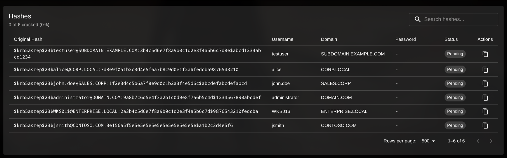

# Hashlists

Hashlists are fundamental to KrakenHashes, representing collections of hashes uploaded for cracking jobs or analysis. This document outlines how hashlists are uploaded, processed, and managed within the system.

## Overview

-   **Definition:** A hashlist is a file containing multiple lines, where each line typically represents a single hash (and potentially its cracked password).
-   **Association:** Each hashlist is associated with a specific Hash Type (e.g., NTLM, SHA1) and can optionally be linked to a Client/Engagement.
-   **Processing:** Uploaded hashlists undergo an asynchronous background processing workflow to ingest the hashes into the central database.
-   **Storage:** Hashlist files are stored on the backend server in a configured directory.

## Uploading Hashlists

Hashlists are typically uploaded through the frontend UI.

1.  **Navigate:** Go to the "Hashlists" section of the dashboard.

*Hashlist Management page showing the upload interface with UPLOAD HASHLIST button and data table displaying hashlist details including Name, Client, Status, Total Hashes, Cracked percentages, and Created dates*

2.  **Initiate Upload:** Click the "Upload Hashlist" button.
3.  **Fill Details:** In the dialog, provide:
    *   **Name:** A descriptive name for the hashlist.
    *   **Hash Type:** Select the correct hash type from the dropdown. This list is populated from the `hash_types` table in the database (see [Hash Types](#hash-types) below). The format displayed is `ID - Name` (e.g., `1000 - NTLM`).
    *   **Client:** (Optional) Select an existing client to associate this hashlist with, or create a new one on the fly.
    *   **File:** Choose the hashlist file from your local machine.
4.  **Submit:** Click the upload button in the dialog.

### API Endpoint

The frontend interacts with the `POST /api/hashlists` endpoint. This endpoint expects a `multipart/form-data` request containing the fields mentioned above (name, hash\_type\_id, client\_id) and the hashlist file itself.

### File Storage

-   Uploaded hashlist files are stored on the backend server.
-   The base directory for uploads is configured via the `KH_DATA_DIR` environment variable.
-   Within the data directory, hashlists are stored in a specific subdirectory, typically `hashlist_uploads`, but configurable via `KH_HASH_UPLOAD_DIR`.
-   The maximum allowed upload size is determined by the `KH_MAX_UPLOAD_SIZE_MB` environment variable (default: 32 MiB).

## Hashlist Processing

Once a hashlist file is uploaded and initial metadata is saved, it enters an asynchronous processing queue.

### Status Workflow

A hashlist progresses through the following statuses:

1.  **`uploading`**: Initial state when the upload request is received.
2.  **`processing`**: The backend worker has picked up the hashlist and is actively reading the file and ingesting hashes.
3.  **`ready`**: Processing completed successfully. All valid lines have been processed and stored. The hashlist is now available for use in cracking jobs.
4.  **`ready_with_errors`**: Processing finished, but one or more lines in the file could not be processed correctly (e.g., invalid format for the selected hash type). Valid lines were still ingested. Check backend logs for details on specific line errors. (Not fully implemented)    `
5.  **`error`**: A fatal error occurred during processing (e.g., file unreadable, database error during batch insert). The `error_message` field on the hashlist provides a general reason. Check backend logs for more details.

### Processing Steps

The backend processor performs the following steps:

1.  **Fetch Details:** Retrieves the hashlist metadata (ID, file path, hash type ID) from the database.
2.  **Open File:** Opens the stored hashlist file.
3.  **Scan Line by Line:** Reads the file line by line.
    *   Empty lines are skipped.
    *   Lines starting with `#` are treated as comments and skipped.
4.  **Extract Hash/Password:**
    *   **Default:** Checks for a colon (`:`) separator. If found, the part before the colon is treated as the hash, and the part after is treated as the pre-cracked password (`is_cracked` = true). If no colon is found, the entire line is treated as the hash (`is_cracked` = false).
    *   **Type-Specific Processing:** For certain hash types (e.g., `1000 - NTLM`), specific processing logic might be applied to extract the canonical hash format from more complex lines (like `user:sid:LM:NT:::`). This logic is determined by the `needs_processing` flag and potentially the `processing_logic` field in the `hash_types` table.
5.  **Batching:** Hashes are collected into batches (size configured by `KH_HASHLIST_BATCH_SIZE`, default: 1000).
6.  **Database Insertion with Deduplication:** Each batch is processed:
    *   **Deduplication Strategy:** The system deduplicates by `original_hash` (the complete input line), not just by `hash_value`. This ensures that different users with the same password hash are preserved as separate entries.
        *   Example: Lines like `Administrator:...:hash123`, `Administrator1:...:hash123`, and `Administrator2:...:hash123` are all stored as distinct hash records.
    *   The system checks if any hashes in the batch already exist in the central `hashes` table (based on `original_hash` and hash type ID).
    *   New, unique hashes are inserted into the `hashes` table with both `hash_value` and `original_hash`.
    *   Entries are created in the `hashlist_hashes` join table to link both new and existing hashes from the batch to the current hashlist.
    *   **Cross-Hashlist Crack Propagation:** When a hash is cracked, ALL hashes with the same `hash_value` (across all hashlists) are automatically marked as cracked. This means if "Administrator", "Administrator1", and "Administrator2" share the same password, cracking one updates all three.
    *   If a hash being added includes a pre-cracked password, the corresponding record in the `hashes` table is updated (`is_cracked`=true, `password`=...).
7.  **Update Status:** Once the entire file is processed, the hashlist status is updated to `ready`, `ready_with_errors`, or `error`, along with the final `total_hashes` and `cracked_hashes` counts.

### Efficient Hashcat Processing

When generating hashlist files for hashcat:
*   **DISTINCT Query:** The system uses a DISTINCT query on `hash_value` to prevent sending duplicate password hashes to hashcat. Even if multiple users share the same password, hashcat only needs to crack it once.
*   **Ordering:** Results are ordered by `hash_value` for stable, consistent output.

## Supported Input Formats

The processor primarily expects:

-   One hash per line.
-   Optional: `hash:password` format for lines containing already cracked hashes.
-   Lines starting with `#` are ignored.
-   Empty lines are ignored.
-   Specific formats handled by type-specific processors (e.g., NTLM).

## Hash Types

-   Supported hash types are defined in the `hash_types` database table.
-   This table is populated by a database migration (`000016_add_hashcat_hash_types.up.sql`) which includes common types and examples sourced from the Hashcat wiki.
-   Each type has an ID (corresponding to the Hashcat mode), Name, Description (optional), Example (optional), and flags indicating if it needs special processing (`needs_processing`, `processing_logic`) or is enabled (`is_enabled`).
-   The frontend uses the `GET /api/hashtypes` endpoint (filtered by `is_enabled=true` by default) to populate the selection dropdown during hashlist upload.

## Managing Hashlists

-   **Viewing:** The "Hashlists" dashboard provides a sortable and filterable view of all accessible hashlists, showing Name, Client, Status, Progress (% Cracked), and Creation Date.

*Detailed view of a hashlist named 'Test' showing ready status, crack progress indicator, and sample hashes section with individual hash entries and their crack status*
-   **Downloading:** Use the download icon on the dashboard or the `GET /api/hashlists/{id}/download` endpoint to retrieve the original uploaded hashlist file.
-   **Deleting:**
    *   Use the delete button in the hashlist detail view (with confirmation dialog) or the `DELETE /api/hashlists/{id}` endpoint.
    *   Deleting a hashlist removes its entry from the `hashlists` table and removes associated entries from the `hashlist_hashes` table.
    *   The original hashlist file is **securely deleted** from backend storage (overwritten with random data before removal).
    *   Individual hashes in the central `hashes` table are *not* deleted if they are referenced by other hashlists.
    *   Orphaned hashes (not linked to any hashlist) are automatically cleaned up.

### Viewing Individual Hashes

The hashlist detail page provides a comprehensive paginated table view of all hashes:

*Paginated table showing individual hashes with username, domain, original hash, cracked password, and status*

**Table Features:**
- **Automatic Sorting**: Cracked hashes appear first for easy review
- **Flexible Pagination**: Choose 500, 1000, 1500, 2000, or view all hashes at once
- **Search Functionality**: Filter hashes across all fields in real-time
- **Quick Copy**: Click the copy icon to copy cracked passwords (or hash if not yet cracked)
- **Status Indicators**: Color-coded chips show crack status at a glance

**Table Columns:**
- **Original Hash**: The complete hash line as it was uploaded
- **Username**: Automatically extracted username (when available)
- **Domain**: Automatically extracted domain information (when available)
- **Password**: The cracked plaintext password (displayed only when cracked)
- **Status**: Visual indicator showing "Cracked" or "Pending"
- **Actions**: Copy button for quick clipboard access

**Username and Domain Extraction:**

KrakenHashes automatically extracts username and domain information from supported hash formats:

- **NTLM (1000)**: Parses pwdump format `DOMAIN\username:sid:LM:NT:::`
- **NetNTLMv1/v2 (5500, 5600)**: Extracts from `username::domain:challenge:response`
- **Kerberos (18200)**: Parses `$krb5asrep$23$user@domain.com:hash`
- **LastPass (6800)**: Extracts email from `hash:iterations:email`
- **DCC/MS Cache (1100)**: Extracts from `hash:username`

Machine accounts (with `$` suffix) are fully preserved: `COMPUTER01$`, `WKS01$`, etc.

## Data Retention

Uploaded hashlists and their associated data are subject to the system's data retention policies. Old hashlists may be automatically purged based on client-specific or default retention settings configured by an administrator. See Admin Settings documentation for details. 