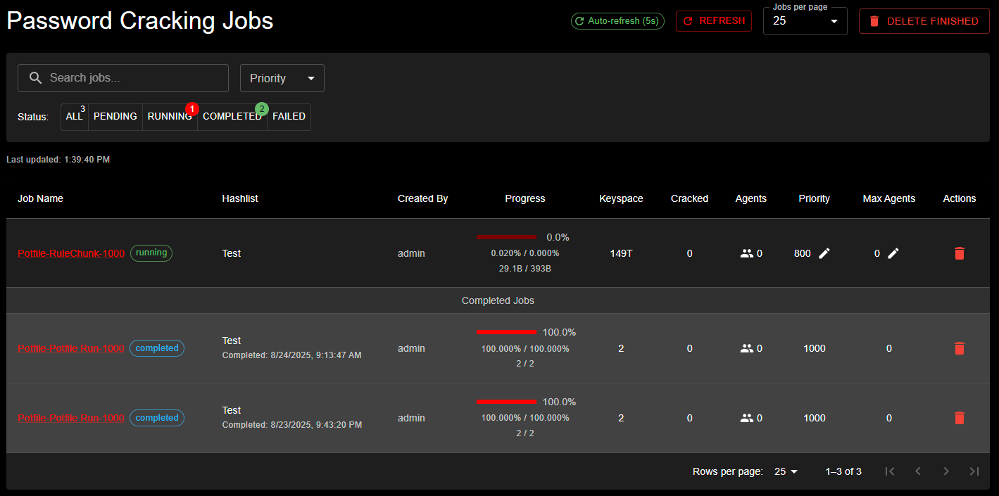

# Understanding Jobs and Workflows

## Quick Overview

KrakenHashes uses a two-tier system to organize password cracking attacks:

1. **Preset Jobs**: Individual attack configurations (like a single recipe)
2. **Job Workflows**: Collections of preset jobs that run in sequence (like a cookbook)

This system ensures consistent, efficient password auditing across your organization.

## How It Works

### The Password Cracking Process

When you submit a hashlist for cracking, KrakenHashes can apply a workflow that:
1. Tries the most likely passwords first (common passwords)
2. Progressively tries more complex attacks
3. Ensures no time is wasted on inefficient approaches

### Example Workflow in Action

Imagine you're auditing passwords for a company. A typical workflow might:

1. **First**: Check against known leaked passwords (fast, high success rate)
2. **Next**: Try common passwords with variations (password1, Password123!)
3. **Then**: Combine company terms with numbers (CompanyName2024)
4. **Finally**: Attempt more exhaustive searches if needed

<screenshot: Visual workflow diagram>

## Benefits

### Consistency
- Every password audit follows the same proven methodology
- No steps are accidentally skipped
- New team members can run expert-level audits immediately

### Efficiency
- Fast attacks run first, finding easy passwords quickly
- Resource-intensive attacks only run when necessary
- Priority system ensures optimal resource usage

### Customization
- Different workflows for different scenarios:
  - Quick compliance checks
  - Thorough security audits  
  - Industry-specific patterns
  - Post-breach assessments

## Common Attack Types

### Dictionary Attacks
Uses lists of known passwords:
- Common passwords (password, 123456)
- Previously leaked passwords
- Industry-specific terms

### Rule-Based Attacks
Applies transformations to dictionary words:
- Capitalize first letter
- Add numbers at the end
- Replace letters with symbols (@ for a, 3 for e)

### Hybrid Attacks
Combines dictionaries with patterns:
- Dictionary word + 4 digits (password2024)
- Year + dictionary word (2024password)

### Brute Force
Tries all possible combinations for a pattern:
- All 4-digit PINs (0000-9999)
- All 6-character lowercase (aaaaaa-zzzzzz)

## Understanding Priorities

Jobs within workflows run in priority order:
- **Critical Priority (90-100)**: Emergency response, security incidents
- **High Priority (70-89)**: Time-sensitive audits, compliance deadlines
- **Normal Priority (40-69)**: Standard security assessments
- **Low Priority (10-39)**: Background processing, research tasks
- **Minimal Priority (0-9)**: Non-urgent, opportunistic processing

### How Priority Affects Your Jobs

1. **Execution Order**: Higher priority jobs start first when agents are available
2. **Resource Allocation**: Critical jobs can use more agents simultaneously
3. **Queue Management**: Jobs with the same priority run in the order they were submitted
4. **Smart Scheduling**: The system optimizes agent assignment based on priorities

<screenshot: Priority visualization>

## Job Interruption and Resumption

KrakenHashes includes an intelligent job interruption system that ensures critical tasks get the resources they need without losing work on other jobs.

### How Job Interruption Works

When a high-priority job needs immediate attention:

1. **Automatic Detection**: The system identifies when critical jobs are waiting
2. **Smart Interruption**: Only interrupts lower priority jobs when necessary
3. **Progress Preservation**: All completed work is saved before interruption
4. **Seamless Resumption**: Interrupted jobs automatically continue when resources are available

### What This Means for Your Jobs

- **No Lost Work**: If your job is interrupted, it will resume from where it stopped
- **Transparent Process**: You'll see the job status change from "running" to "pending" and back
- **Fair Resource Sharing**: The system balances urgent needs with ongoing work
- **Automatic Management**: No manual intervention required for resumption

### Understanding Job Statuses

*The Jobs Management interface showing active password cracking jobs with status filtering (ALL, PENDING, RUNNING, COMPLETED, FAILED). The table displays job details including name, hashlist, progress, keyspace, cracked count, agents assigned, priority level, and available actions.*

- **Pending**: Job is waiting for available agents
- **Running**: Job is actively being processed
- **Completed**: Job finished successfully
- **Failed**: Job encountered an error
- **Interrupted**: Job was paused for a higher priority task (automatically resumes)

### Priority Best Practices

To ensure optimal performance:

1. **Use Appropriate Priorities**: Don't mark everything as high priority
2. **Plan for Interruptions**: Expect that low-priority jobs may pause for critical work
3. **Monitor Progress**: Check job status regularly for time-sensitive tasks
4. **Communicate Urgency**: Work with administrators to set correct priorities for critical audits

## Real-World Applications

### Compliance Auditing
Verify passwords meet policy requirements:
- Minimum length checks
- Complexity requirements
- Banned password lists

### Security Assessments
Identify weak passwords before attackers do:
- Test against current attack techniques
- Benchmark password strength
- Provide actionable reports

### Incident Response
Quickly assess breach impact:
- Check if compromised passwords are reused
- Identify affected accounts
- Prioritize password resets

## What This Means for You

As a user, the preset jobs and workflows system:
- Ensures thorough password testing
- Provides consistent results
- Optimizes cracking time
- Delivers actionable insights

Your administrators have configured these workflows based on:
- Industry best practices
- Your organization's specific needs
- Current threat landscape
- Compliance requirements

## Next Steps

- Review your hashlist results to understand which attacks succeeded
- Work with your security team to address found passwords
- Consider implementing stronger password policies
- Schedule regular password audits using these workflows

For more detailed information about creating and managing workflows, see the [administrator documentation](../admin/preset_jobs_and_workflows.md).